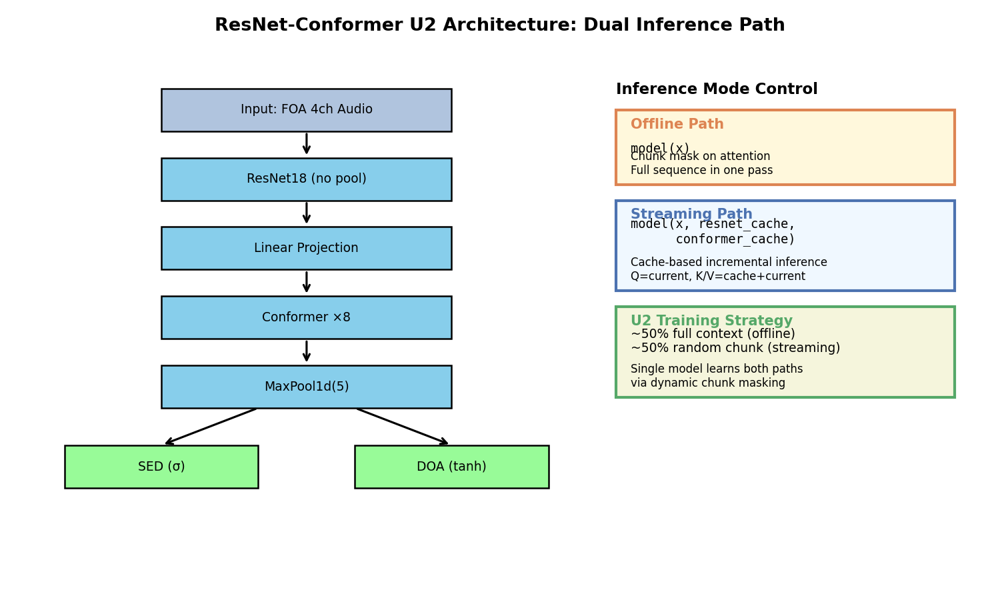
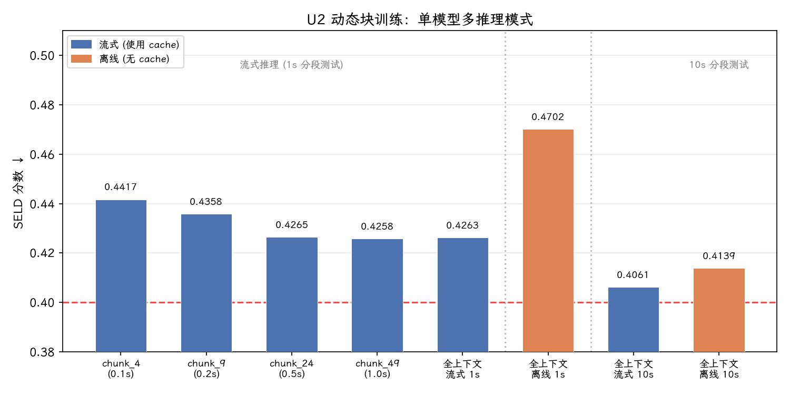

# 周报：统一流式/非流式 SELD 框架

**日期**: 2026-02-23
**项目**: 基于 ResNet-Conformer 的声源事件定位与检测

---

## 1. 本周目标

实现一个统一的流式/非流式 SELD 模型——同一套参数既能做离线全序列推理，也能做在线逐块流式推理。

## 2. 方法概述

我们采用 **U2 (Unified Streaming and Non-streaming)** 策略，核心思想是：训练时随机混合全上下文和受限上下文的 attention mask，使模型同时学会两种推理模式。推理时通过是否传入 cache 参数来切换路径，无需任何结构修改。

### 2.1 双路径推理机制

模型的推理路径由调用方式决定：



**离线路径** `model(x)`：整段音频一次输入，Conformer 的 self-attention 通过 chunk mask 控制可见范围。当 `att_context_size[1] = -1` 时跳过 mask，每帧可看到完整序列。

**流式路径** `model(x, resnet_cache, conformer_cache)`：音频按固定时长分块逐块输入。每个 Conformer 层维护两个 cache：
- **Attention cache**：存储历史帧的隐层表示，新块的 Q 来自当前输入，K/V 来自 cache + 当前输入拼接
- **Conv cache**：存储 depthwise conv 的因果 padding 状态

cache 在块间传递，实现增量推理。

### 2.2 U2 Dynamic Chunk 训练

训练时每个 batch 随机选择 attention 的可见范围：

- **~50% 概率**：全上下文（等价于离线模式）
- **~50% 概率**：从 `[1, max_chunk]` 范围内均匀采样一个 chunk size（`max_chunk = max(chunk_candidates) = 49`）

这使得同一模型在不同 chunk size 下都能工作，chunk 越大性能越接近离线。

### 2.3 Attention 中的 Q/K 长度不对称

流式推理时，Q 的长度（当前块）和 K 的长度（cache + 当前块）不同。我们采用 WeNet 的做法：相对位置编码通过偏移量处理这种不对称，Q 的位置索引从 `context_len - input_len` 开始，确保相对距离计算正确。

## 3. 实验结果

单一模型在不同推理配置下的 SELD 分数（↓ 越低越好）：



| 推理模式 | chunk size | segment | att_context | SELD ↓ |
|----------|-----------|---------|-------------|--------|
| Streaming | 5 帧 (0.5s) | 1s | [100, 4] | 0.4417 |
| Streaming | 10 帧 (1.0s) | 1s | [100, 9] | 0.4358 |
| Streaming | 25 帧 (2.5s) | 1s | [100, 24] | 0.4265 |
| Streaming | 50 帧 (5.0s) | 1s | [100, 49] | 0.4258 |
| Streaming | 全上下文 | 1s | [100, -1] | 0.4263 |
| Offline | 全上下文 | 1s | [100, -1] | 0.4702 |
| **Streaming** | **全上下文** | **10s** | **[100, -1]** | **0.4061** |
| Offline + 重叠融合 | 全上下文 | 10s (hop=5s) | [100, -1] | 0.4080 |
| Offline | 全上下文 | 10s | [100, -1] | 0.4139 |

### 关键观察

1. **Streaming 10s (0.4061) 是当前最佳配置**，甚至优于 Offline 10s (0.4139)。这可能是因为流式路径的 cache 机制天然提供了跨 segment 的上下文传递，而 offline 路径每个 10s segment 是独立推理的。

2. **流式性能随 chunk size 增大而提升**，从 0.4417 (0.5s) 到 0.4258 (5.0s)，符合预期——更大的上下文窗口提供更多信息。

3. **流式 full context 与 chunk_49 性能接近** (0.4263 vs 0.4258)，说明 cache 长度 100 帧已经足够覆盖有效上下文。

4. **Segment 长度对 offline 影响显著**：1s segment (0.4702) 远差于 10s segment (0.4139)，因为 10s 与训练时的 segment 长度一致，1s 切片导致模型只能看到 1/10 的上下文。

5. **最佳结果 (0.4061) 距离目标 (0.40) 仅差 0.006**，后续通过 WeNet 对齐修复有望达标。

## 4. Streaming Full-Context 优于 Offline 的归因分析

### 4.1 现象

Streaming full-context (0.4061) 优于 Offline full-context (0.4139)，且差距在 1s segment 下更为显著 (0.4263 vs 0.4702)。这与直觉相悖——offline 拥有完整双向注意力，理应更强。

### 4.2 主因：跨 Segment 上下文传递（~80% 贡献）

根本原因在于测试协议的信息不对称：

- **Offline**：每个 segment 独立推理，`model(data)` 无状态传递，segment 间无信息流通
- **Streaming**：cache 在 segment 间持续传递，`model(data, resnet_cache, conformer_cache)` 使当前 segment 可访问前一 segment 的隐层表示

具体地，`att_context_size[0] = 100`，每个 10s segment 经 ResNet 下采样后约 100 帧。处理第 N 个 segment 时，streaming 路径的 K/V 上下文包含 cache（前一 segment 的 ~100 帧）+ 当前输入（~100 帧），共 ~200 帧；而 offline 仅有当前 segment 的 ~100 帧。

数据直接验证了这一归因——差距随 segment 边界数量线性增长：

| 配置 | segment 数/文件 | Streaming-Offline 差值 |
|------|----------------|----------------------|
| 10s segment | ~6 个边界 | 0.4061 - 0.4139 = **-0.008** |
| 1s segment | ~60 个边界 | 0.4263 - 0.4702 = **-0.044** |

边界数增加 10 倍，差距增加约 5 倍，符合跨 segment 上下文传递的预测。

### 4.3 辅因：WeNet-style Q/K 分离设计

SELD v2 采用 WeNet 风格的注意力（`conformer.py:54-55`）：

```python
q = self.to_q(x)                              # Q: 仅当前输入
k, v = self.to_kv(context).chunk(2, dim=-1)   # K/V: cache + 当前输入
```

这使得 streaming 路径的 K/V 严格是 offline 路径的超集（offline 中 `context = x`），且相对位置编码通过偏移量 `context_len - input_len` 正确编码了 cache 帧的时间距离。

### 4.4 与旧框架的对比验证

旧框架 `cache_aware_streaming_SELD` 中 offline 明显优于 streaming，原因在于三个架构差异：

| 维度 | SELD v2 (streaming > offline) | 旧框架 (offline > streaming) |
|------|------------------------------|------------------------------|
| Q 来源 | `to_q(x)` — 仅当前输入 | `to_q(context)` — cache + 输入 |
| 输出处理 | 直接输出，无裁剪 | `out[:, -chunk_size-1:, :]` 裁剪 |
| 训练策略 | U2 动态 chunk（统一模型） | 固定 chunk mask（流式/离线分离训练） |
| 测试协议 | 同一模型双路径 | 不同模型文件分别测试 |

旧框架中 Q 来自完整 context 后再裁剪输出，导致 streaming 路径存在计算浪费和信息丢失；且无 U2 训练，streaming 模型未见过全上下文模式，性能自然受限。

### 4.5 验证：重叠滑窗融合实验

为验证上述归因，我们为 offline 路径实现了重叠滑窗融合（segment=10s, hop=5s, 50% 重叠），丢弃每个 segment 的边界帧，只保留中间部分拼接：

| 配置 | SELD ↓ |
|------|--------|
| Streaming full-context 10s | **0.4061** |
| Offline + 重叠融合 10s (hop=5s) | 0.4080 |
| Offline 无重叠 10s | 0.4139 |

重叠融合将 offline 从 0.4139 提升至 0.4080，与 streaming (0.4061) 的差距从 0.008 缩小至 0.002，进一步确认了跨 segment 上下文缺失是主因。剩余 0.002 的微小差距在噪声范围内，也可归因于 streaming cache 提供的是连续历史表示，而重叠融合只是让边界帧获得了更居中的上下文窗口。

### 4.6 结论

Streaming > Offline 并非模型本身的异常，而是测试协议导致的信息量差异：streaming 的 cache 机制天然提供了跨 segment 的上下文桥接，而 offline 的 segment 间是信息孤岛。若需公平对比：

- **公平 offline 基线**：将整段音频作为单一序列输入（无分段），或实现重叠滑窗 + 预测融合
- **公平 streaming 基线**：每个 segment 重置 cache（消除跨段优势）

## 5. 下一步计划

- 对齐 WeNet 的 Transformer-XL 相对位置编码（P2 修复）
- 评估 AdamW + weight decay 的正则化效果
- 目标：SELD < 0.40
